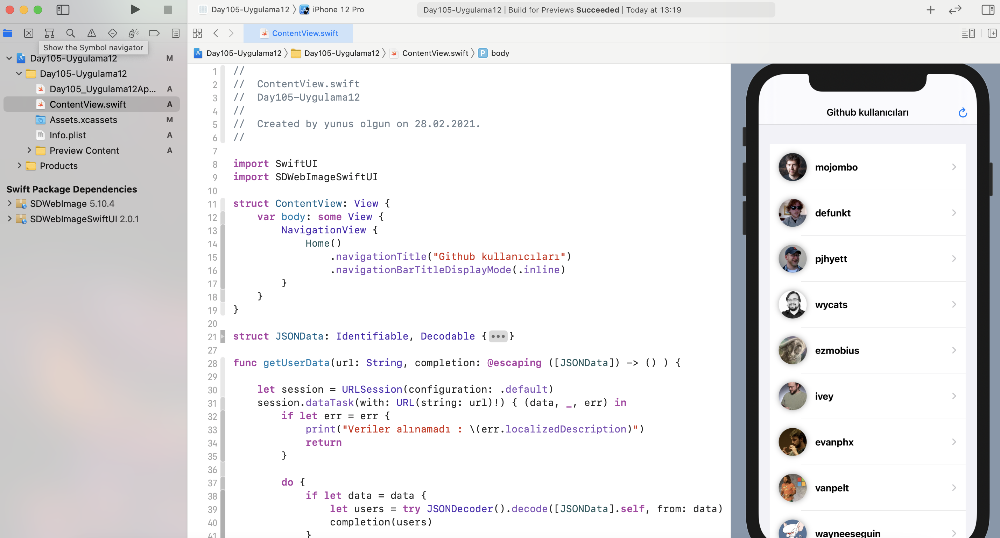

# Uygulama - 12

  <h3>Uygulama 12</h3>
  1- SwiftUI uygulaması ile internet üzerinden JSON veri çekilmesi ve list ile gösterilmesi.  
  2- Aynı zamanda çekilen JSON veriden gelen bilgiler ile SDWebImageSwiftUI pod kullanılarak resimlerin gösterilmesi

  <h3>Örnek1</h3>
  

  

