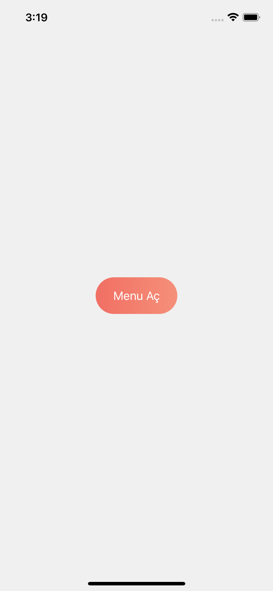
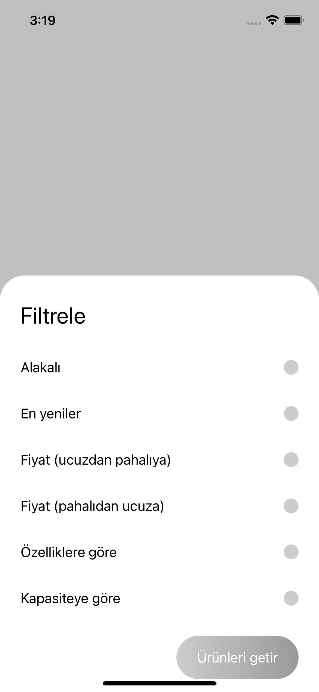
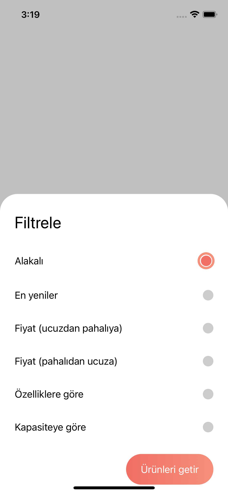
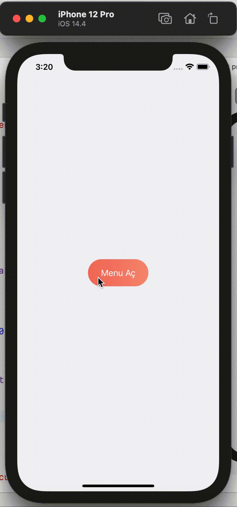

# Uygulama - 13

  <h3>Uygulama 13</h3>
  Menü butonuna basılınca radiobutton menüsü geliyor. Butonlardan birine basılınca ürünleri seç butonu aktif hale geliyor.  
  Çıkan popta başka bir yere basılınca ürünleri seç deaktif oluyor. Ana ekrana basınca popup menü kapanıyor.

  <h3>Screenshotlar</h3>
  
  
  

<h3>Gif</h3>
  

