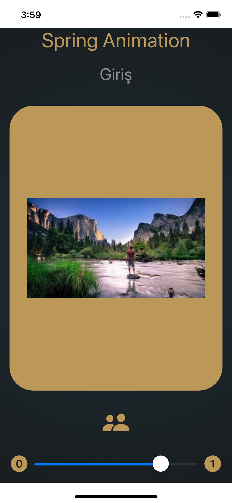
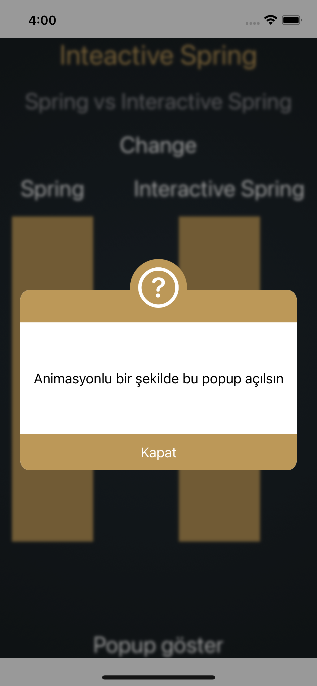
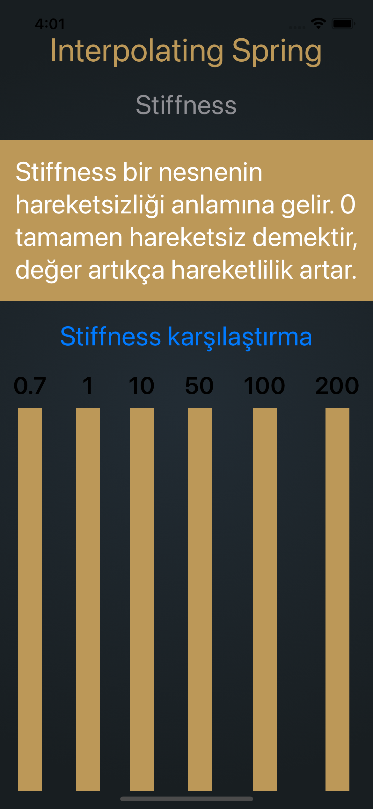
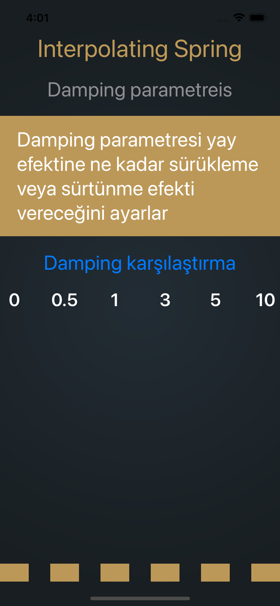
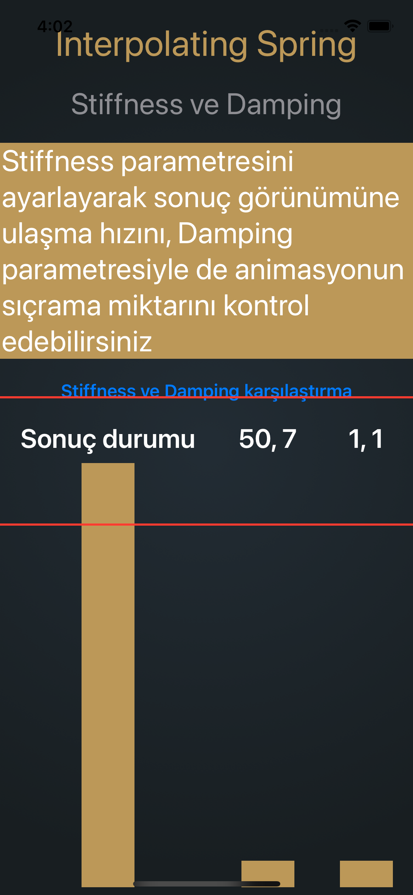
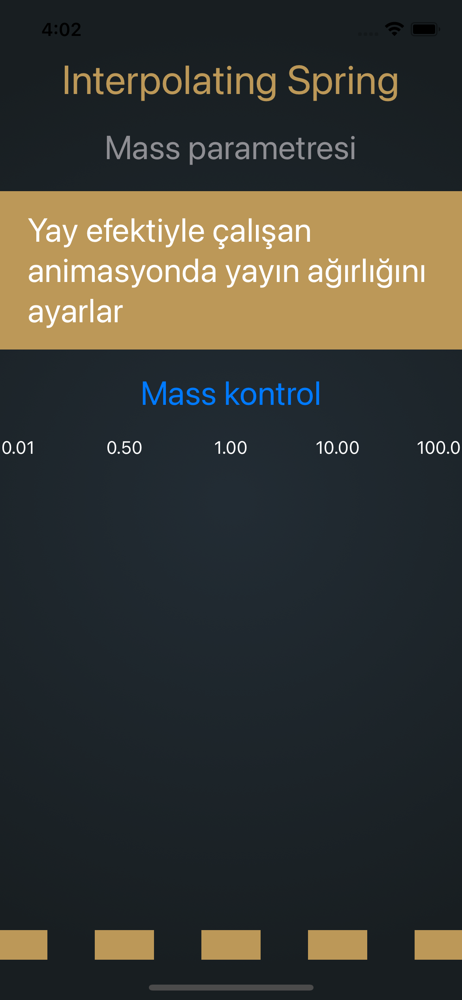
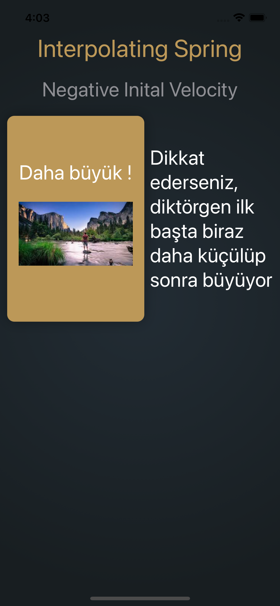
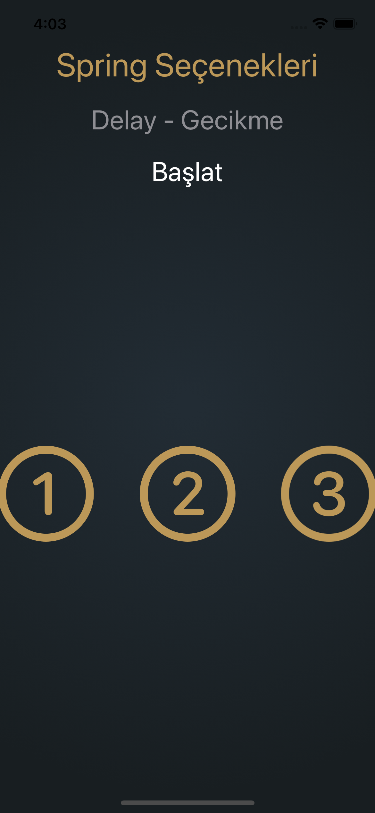
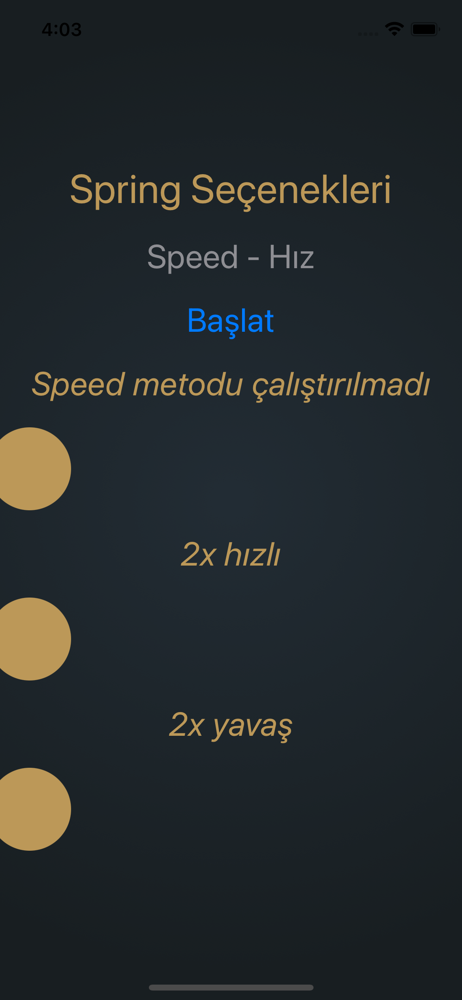
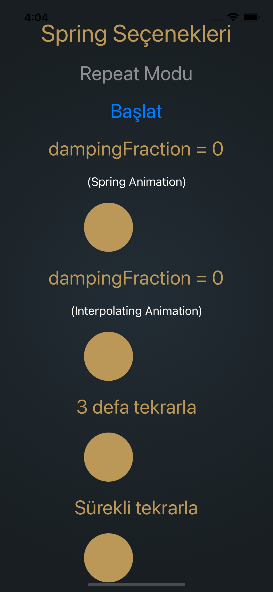

# Yaylı Animasyon ÖRNEKLERİ

  <h3>Örnek1</h3>
  

  <h3>Örnek2</h3>
  

  <h3>Örnek3</h3>
  

  <h3>Örnek4</h3>
  

  <h3>Örnek5</h3>
  

  <h3>Örnek6</h3>
  

  <h3>Örnek7</h3>
  

  <h3>Örnek8</h3>
  

  <h3>Örnek9</h3>
  

  <h3>Örnek10</h3>
  

  <h3>Örnek11</h3>
  

